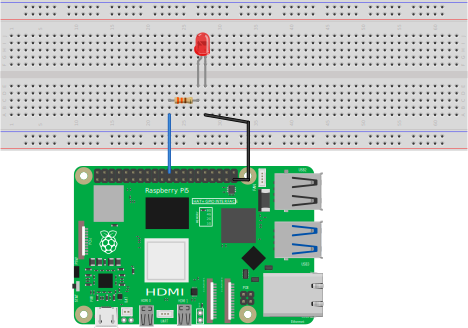

# OmniMouse

This is a project to create a micro mouse using a Raspberry Pi 5 and an omni wheel and compete in a micro mouse competition.

Raspberry Pi 5とオムニホイールを使ったマイクロマウスを制作し、マイクロマウス大会に出場するプロジェクトです。

## Document

1. [Raspberry Pi 5をヘッドレスでセットアップ](docs/raspberry_pi_5_os_setup.md)
2. [ROS2(Jazzy Jalisco)をインストール](docs/ros2_setup.md)

## Setup(セットアップ)

1. Documentの1., 2.を参照してセットアップしてください。
2. 以下のコマンドを実行します。  
   ```
   mkdir -p ~/ros2_ws/src
   cd ~/ros2_ws/src
   git clone git@github.com:horie-t/omni-mouse.git
   cd ~/ros2_ws
   colcon build --symlink-install
   ```

## Usage(使い方)

下図のようにLEDと抵抗(330Ω)を接続します。Raspberry Piのピンは22番(GPIO 25)と39番(GND)を使用します。



以下のようにコマンドを実行します。コンソールにメッセージが表示されると共にLDEが点滅します。
```
$ ros2 run l_chika l_chika_node
Start program
Generate Node
[INFO] [1714888685.958845078] [l_chika_node]: Hi from l_chika.
[INFO] [1714888686.442169731] [l_chika_node]: Hi from l_chika.
[INFO] [1714888686.942117191] [l_chika_node]: Hi from l_chika.
[INFO] [1714888687.442118320] [l_chika_node]: Hi from l_chika.
```