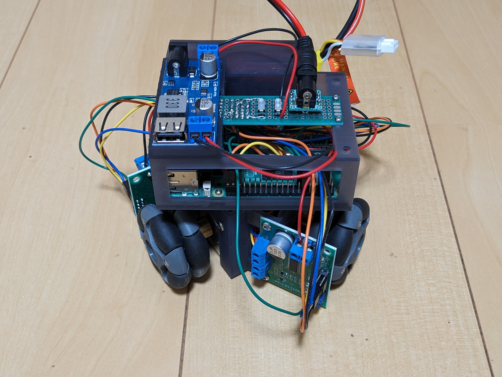
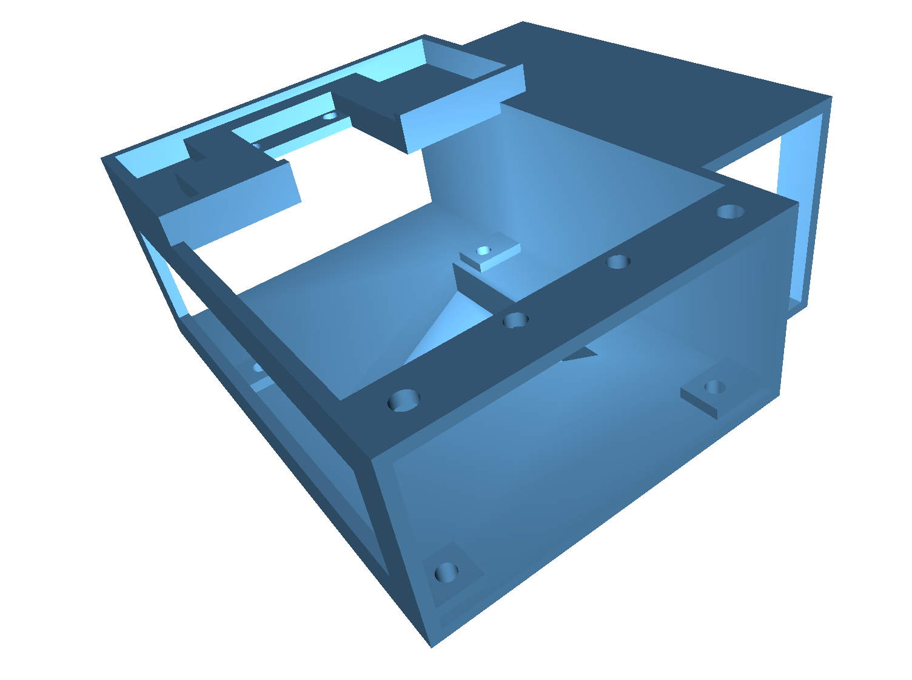
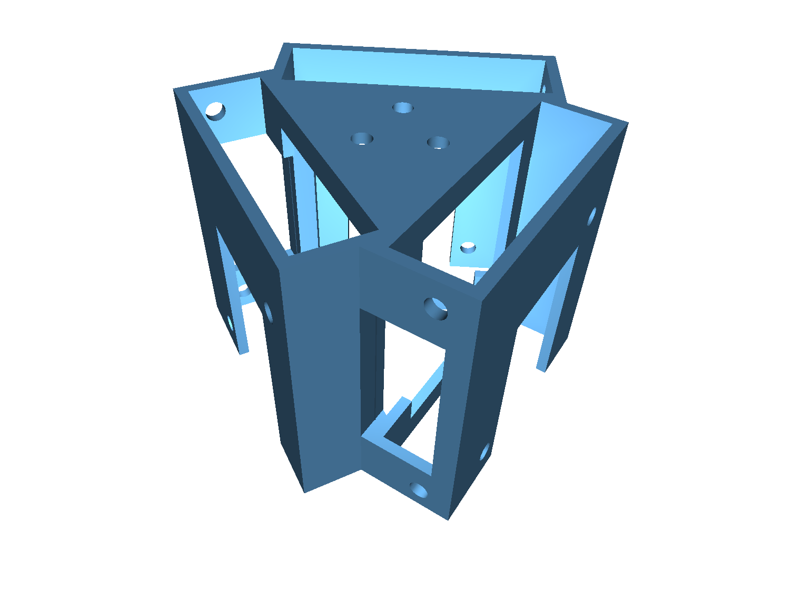

# OmniMouse

This is a project to create a micro mouse using a Raspberry Pi 5 and an omni wheel and compete in a micro mouse competition.

Raspberry Pi 5とオムニホイールを使ったマイクロマウスを制作し、マイクロマウス大会に出場するプロジェクトです。

## Structure

## Circuit

## Document

1. [Raspberry Pi 5をヘッドレスでセットアップ](docs/raspberry_pi_5_os_setup.md)
2. [ROS2(Jazzy Jalisco)をインストール](docs/ros2_setup.md)
3. [Raspberry Pi 5をバッテリーで稼働させる](docs/running_raspberry_pi_5_on_battery.md)
4. [Raspberry Pi 5とステッピングモータを接続する](docs/3_stepper_motor.md)