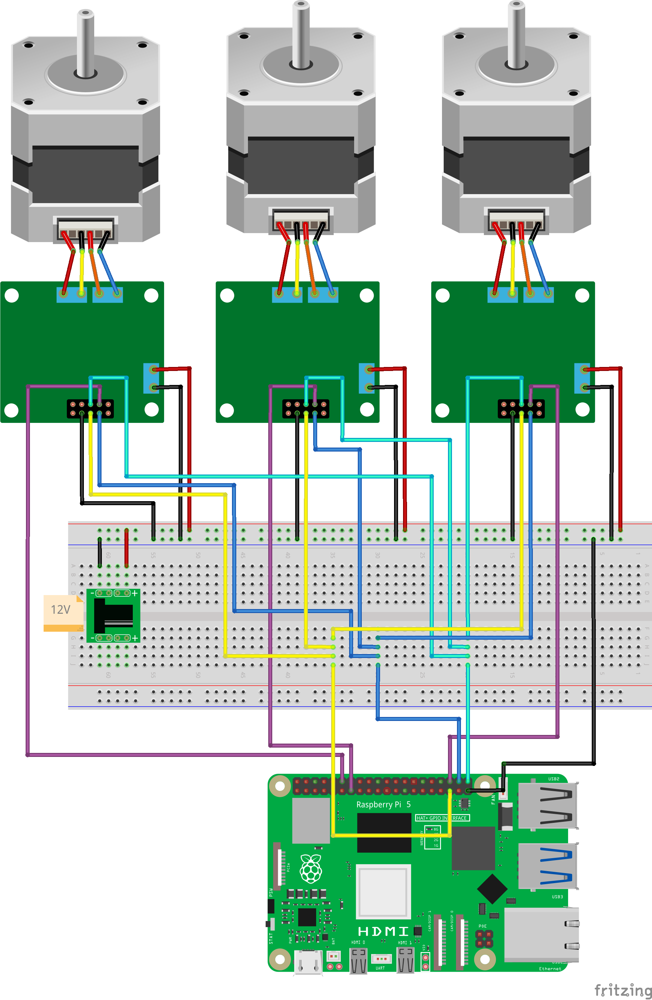

# 3つのステッピング・モーターを回転させる

## 必要なもの

* Raspberry Pi 5
* [L6470 ステッピングモーター・ドライバー](https://akizukidenshi.com/catalog/g/g107024/)
* [バイポーラ・ステッピングモータ](https://jp.misumi-ec.com/vona2/detail/221005433134/?HissuCode=SS2421-5041)
* [12V ACアダプター](https://amzn.to/3QObFSW)
* [DCジャック](https://akizukidenshi.com/catalog/g/g105148/)

## 準備

下図のようにステッピングモーター等を接続します。何故かSPI1のcs1の出力がloのままで固定されていたので、cs1のピンの割り当てを変更しています。



`/boot/firmware/config.txt`ファイルに以下の行を追加します。

```text
dtoverlay=spi1-3cs,cs1_pin=27
```

## 実行

以下のコマンドを実行します。

```
ros2 run three_stepper_motor three_stepper_motor_node
```

## ソースコード

ソースコードは[こちら](https://github.com/horie-t/omni-mouse/tree/main/three_stepper_motor)

## 補足

### SPI1のCS1の電位がloのままになる現象について

ヘッダピンの13番(GPIO27)のピンへの接続は、11番(GPIO17)のピンに接続するはずでした。ですがGPIOのピンの状態が以下のようにGPIO17はloになってしまいます。

```
$ cat /sys/kernel/debug/gpio
# 中略
 gpio-587 (GPIO16              |spi1 CS2            ) out hi ACTIVE LOW
 gpio-588 (GPIO17              |spi1 CS1            ) out lo ACTIVE LOW
 gpio-589 (GPIO18              |spi1 CS0            ) out hi ACTIVE LOW
# 後略
```

以下の`pinctrl`コマンドで変更させようとしても変化なしでした。

```
pinctrl set 17 op dh
```

仕方がないので、今回のようにピンの割り当てを変更しました。