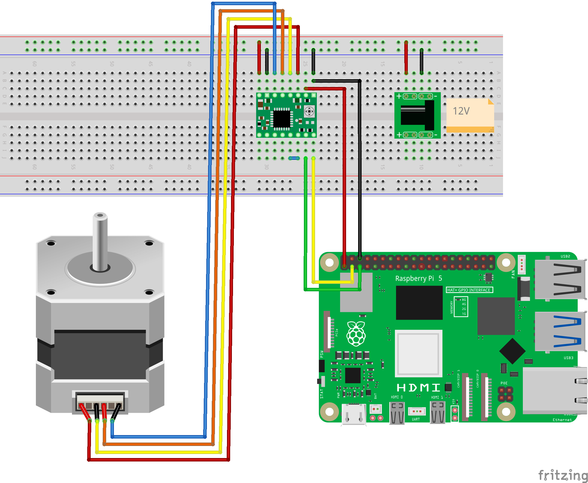

# A4988 ステッピングモーター・ドライバーを使ってステッピングモーターを回転させる

## 必要なもの

* Raspberry Pi 5
* [A4988 ステッピングモーター・ドライバー](https://amzn.to/4bAHpmk)
* [バイポーラ・ステッピングモータ](https://jp.misumi-ec.com/vona2/detail/221005433134/?HissuCode=SS2421-5041)
* [12V ACアダプター](https://amzn.to/3QObFSW)
* [DCジャック](https://akizukidenshi.com/catalog/g/g105148/)

## 準備

下図のようにステッピングモーター等を接続します。



## 実行

以下のようにコマンドを実行します。

```
$ ros2 run a4988_stepper_motor a4988_stepper_motor_node 
Start program
Generate Node
[INFO] [1715767269.755622242] [stepper_motor_node]: Hi from stepper_motor.
[INFO] [1715767269.756871086] [stepper_motor_node]: Hi from stepper_motor.
[INFO] [1715767269.767004386] [stepper_motor_node]: Hi from stepper_motor.
```

## ソースコード

ソースコードは[こちら](https://github.com/horie-t/omni-mouse/tree/main/a4988_stepper_motor)