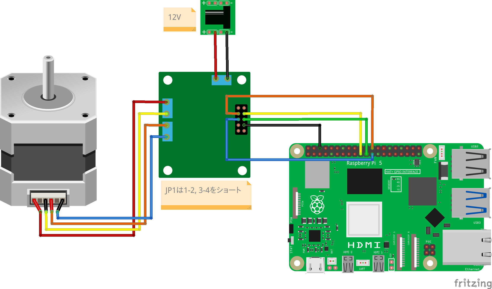

# L6470 ステッピングモーター・ドライバーを使ってステッピングモーターを回転させる

## 必要なもの

* Raspberry Pi 5
* [L6470 ステッピングモーター・ドライバー](https://akizukidenshi.com/catalog/g/g107024/)
* [バイポーラ・ステッピングモータ](https://jp.misumi-ec.com/vona2/detail/221005433134/?HissuCode=SS2421-5041)
* [12V ACアダプター](https://amzn.to/3QObFSW)
* [DCジャック](https://akizukidenshi.com/catalog/g/g105148/)

## 準備

下図のようにステッピングモーター等を接続します。



## 実行

以下のようにコマンドを実行します。

```
$ ros2 run motor_drive motor_drive_node 
Start program
Generate Node
```

## ソースコード

ソースコードは[こちら](https://github.com/horie-t/omni-mouse/tree/main/motor_drive)