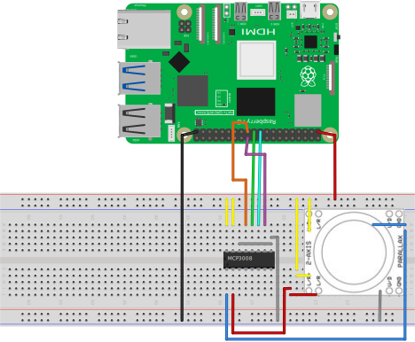

# SPI通信でA/Dコンバーターの値を読み込む

## 必要なもの

* Raspberry Pi 5
* [MCP3008](https://akizukidenshi.com/catalog/g/g109485/)
* [Parallax Inc 2-axis analogue joystick module 27800](https://amzn.to/3QF8iO7)

## 準備

下図のようにA/Dコンバーターとジョイスティックを接続します。




## 実行

以下のようにコマンドを実行します。コンソールに値がが表示されます。

```
$ ros2 run read_adc read_adc_node
Start program
Generate Node
[INFO] [1715389212.131618758] [read_adc_node]: CH0 volts: 1.70
[INFO] [1715389212.132790350] [read_adc_node]: CH1 volts: 1.57
[INFO] [1715389212.319837573] [read_adc_node]: CH0 volts: 1.71
[INFO] [1715389212.321008498] [read_adc_node]: CH1 volts: 1.58
[INFO] [1715389212.513927365] [read_adc_node]: CH0 volts: 1.71
```

## ソースコード

ソースコードは[こちら](https://github.com/horie-t/omni-mouse/tree/main/read_adc)。